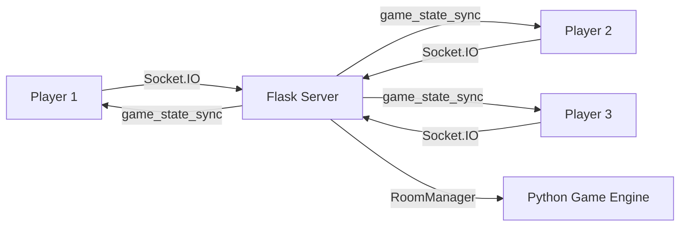

## Game Overview

**Moche** is a traditional Nicaraguan rummy-style card game where players compete to form sets (tercias) and runs (corridas) using a standard 52-card deck. The first player to get all their cards on the table wins!

<Note>
Moche Premium features 4 difficulty levels, 1-3 AI opponents, real-time multiplayer via Socket.IO, and drag-and-drop card management.
</Note>

## Game Objective

**Win by having all 10 cards on the table in valid groups (moches) with 0 cards in hand.**

Players achieve this by:
1. Forming new moches (3-4 card sets/runs)
2. Adding cards to existing moches on the table
3. Strategically discarding unwanted cards

## Card Values & Rules

### Standard Deck

- **52 cards**: 4 suits (♠ ♥ ♦ ♣) × 13 ranks (A-K)
- **Ace flexibility**: Can be low (A-2-3) or high (Q-K-A)
- **Card values**: A=1, 2=2, ..., 10=10, J=11, Q=12, K=13

```javascript
// From moche.js:217
const VALUES = { 
  'A': 1, '2': 2, '3': 3, '4': 4, '5': 5, '6': 6, 
  '7': 7, '8': 8, '9': 9, '10': 10, 'J': 11, 'Q': 12, 'K': 13 
};
```

### Valid Moche Combinations

<Tabs>
  <Tab title="Tercia (Set)">
    **3-4 cards of the same rank**
    
    Examples:
    - ♠7 ♥7 ♦7 (Three 7s)
    - ♣K ♠K ♥K ♦K (Four Kings)
    
    ```javascript
    // Validation from moche.js:964
    const isTercia = selectedCards.every(c => c.rank === selectedCards[0].rank);
    ```
  </Tab>
  
  <Tab title="Corrida (Run)">
    **3-4 consecutive cards of the SAME suit**
    
    Examples:
    - ♠5 ♠6 ♠7 (Spade run)
    - ♥10 ♥J ♥Q ♥K (Heart run high)
    - ♦A ♦2 ♦3 (Diamond run low)
    
    ```javascript
    // Must be same suit from moche.js:970
    const isSameSuit = sorted.every(c => c.suit === sorted[0].suit);
    if (!isSameSuit) return false;
    
    // Sequential values from moche.js:974-978
    const isCorrida = sorted.every((c, idx) => {
      if (idx === 0) return true;
      return c.value === sorted[idx - 1].value + 1;
    });
    ```
  </Tab>
  
  <Tab title="Ace Special Cases">
    **Ace can be used as 1 OR 14**
    
    Valid with Ace:
    - ♠A ♠2 ♠3 (Low ace = 1)
    - ♠Q ♠K ♠A (High ace = 14)
    
    Invalid:
    - ♠K ♠A ♠2 (Ace can't be middle)
    
    ```javascript
    // High ace handling from moche.js:981-991
    if (sorted[0].rank === 'A') {
      let pseudoAce = { ...ace, value: 14 };
      modifiedSorted.push(pseudoAce);
      const isHighAceCorrida = modifiedSorted.every((c, idx) => {
        if (idx === 0) return true;
        return c.value === modifiedSorted[idx - 1].value + 1;
      });
    }
    ```
  </Tab>
</Tabs>

## Game Phases

Moche follows a structured turn-based flow:

<Steps>
  <Step title="REPARTO (Deal)">
    Each player receives **9 cards** face down. Cards are dealt one at a time in a rotating fashion.
    
    ```python
    # From moche_engine.py:207-213
    def _deal_initial_cards(self, room):
        state = room["state"]
        for _ in range(9):
            for pid in state["turnOrder"]:
                if len(state["deck"]) > 0:
                    state["players"][pid]["cards"].append(state["deck"].pop())
    ```
    
    **Instant win conditions** checked:
    - **Moche de Mano**: Receiving 4 identical cards = instant win
    - **Moche de Color**: All 9 cards same color (red/black)
  </Step>
  
  <Step title="INTERCAMBIO (Exchange)">
    One-time phase where each player passes **1 card to the right** simultaneously.
    
    - Human selects which card to pass
    - Bots pass a random card
    - All exchanges happen at once
    
    ```javascript
    // From moche.js:909-918
    for (let i = 0; i < turnOrder.length; i++) {
      const currentPid = turnOrder[i];
      const nextIdx = (i + 1) % turnOrder.length;
      const nextPid = turnOrder[nextIdx];
      
      if (passes[currentPid]) {
        STATE.players[nextPid].cards.push(passes[currentPid]);
      }
    }
    ```
  </Step>
  
  <Step title="BAJADA_INICIAL (Initial Lay)">
    Before turns begin, all players can lay down initial moches **without discarding**.
    
    - Lay as many valid 3-4 card groups as you want
    - No time limit (single-player)
    - Click **✅ Todos Listos!** when done
  </Step>
  
  <Step title="JUEGO (Main Game)">
    Turn-based gameplay:
    
    1. **Draw**: Take from deck or discard pile
    2. **Play** (optional): Form new moches or extend existing ones
    3. **Discard**: Throw 1 card to discard pile
    
    Turns rotate clockwise until someone wins.
  </Step>
  
  <Step title="INTERCEPT (Optional)">
    When a player discards, the **next player** can intercept before their turn:
    
    - Click **🎴 Tomar Descarte** to claim the discard
    - Must immediately use it in a moche
    - Then discard to end the intercept action
    
    ```javascript
    // From moche.js:1394-1404
    function iniciarIntercepcionManual() {
      STATE.phase = 'INTERCEPT_DISCARD';
      STATE.mustUseDiscard = true;
      DOM.turnIndicator.innerText = 
        'Tomaste el descarte. Úsalo en un moche o extensión, luego bota una carta.';
      DOM.btnTomar.classList.add('hidden');
      actualizarBotonesJuego();
    }
    ```
  </Step>
</Steps>

## How to Play Your Turn

<Tabs>
  <Tab title="Drawing Phase">
    **Click the deck or discard pile to draw:**
    
    ### From Deck
    ```javascript
    // From moche.js:1470
    function robarDelMazo() {
      if (!isMyTurn() || STATE.hasDrawn) return;
      
      const card = STATE.deck.pop();
      STATE.drawnCardRef = card;
      STATE.hasDrawn = true;
      STATE.drawnCardAnim = 'card-fly-in';
      STATE.latestDiscardEnlarged = false;
      
      renderMesa();
      actualizarBotonesJuego();
    }
    ```
    
    - Card appears in special "Drawn Card" zone
    - Can use immediately or discard
  </Tab>
  
  <Tab title="Playing Moches">
    **Two ways to play cards:**
    
    ### 1. Form New Moche
    - Select 3-4 cards from your hand (click to toggle)
    - Cards must form valid tercia or corrida
    - Click **Bajar Moche** button
    - Group appears on your table zone
    
    ### 2. Extend Existing Moche
    - Select cards from hand
    - Click on any moche group (yours or opponents')
    - Cards must keep the group valid
    - Extended group stays with original owner
    
    ```javascript
    // From moche.js:1186-1189
    const combined = [...targetGrupo, ...selectedCards];
    
    if (esMocheValido(combined)) {
      targetGrupo.push(...selectedCards);
    }
    ```
  </Tab>
  
  <Tab title="Discarding">
    **End your turn by discarding:**
    
    - Select 1 card from hand or the drawn card
    - Click **Pasar Turno** or **Botar Carta**
    - Card moves to discard pile (top visible)
    - Turn passes to next player
    
    <Warning>
    You **must** discard after drawing! The game won't let you skip this.
    </Warning>
  </Tab>
</Tabs>

## Special Win Conditions

<CardGroup cols={2}>
  <Card title="Moche de Mano" icon="hand-sparkles">
    **Receive 4 identical cards** during the initial deal.
    
    - Instant win before any play begins
    - Extremely rare (~0.4% chance)
    - Awards 6x bet multiplier
    
    ```javascript
    // From moche.js:491-510
    function verificarMocheDeMano() {
      for (let key of STATE.turnOrder) {
        const player = STATE.players[key];
        for (let card of player.cards) {
          rankCounts[card.rank] = (rankCounts[card.rank] || 0) + 1;
          if (rankCounts[card.rank] === 4) {
            STATE.phase = 'FIN';
            mostrarAlerta('Moche de Mano', alertMsg, 'Volver a Jugar');
            return true;
          }
        }
      }
    }
    ```
  </Card>
  
  <Card title="Moche de Color" icon="palette">
    **All 9 initial cards are the same color** (red ♥♦ or black ♠♣).
    
    - Human gets **choice** to cash out for 6x bet
    - Bots auto-win if they have it
    - Click purple **🎉 Moche de Color!** button to claim
    
    ```javascript
    // From moche.js:521-526
    const allRed = player.cards.every(c => c.isRed);
    const allBlack = player.cards.every(c => !c.isRed);
    
    if (allRed || allBlack) {
      // Special 6x prize!
      const premio = STATE.apuestaActual * 6;
    }
    ```
  </Card>
  
  <Card title="Normal Victory" icon="trophy">
    **All 10 cards on table, 0 in hand.**
    
    - Win by strategic play over multiple turns
    - Standard 2x bet payout
    - Most common win condition
  </Card>
  
  <Card title="Auto Victory" icon="sparkles">
    **10 cards on table detected mid-turn.**
    
    - Game auto-ends when you place last card
    - Triggers confetti animation
    - Immediate payout
    
    ```javascript
    // From moche.js:1128-1146
    function verificarVictoriaAuto(playerId) {
      const cardsInHand = player.cards.length + (STATE.drawnCardRef ? 1 : 0);
      const cardsOnTable = player.bajadas.reduce((sum, g) => sum + g.length, 0);
      
      if (cardsOnTable >= 10 && cardsInHand === 0) {
        ganarPartida();
        return true;
      }
    }
    ```
  </Card>
</CardGroup>

## Difficulty Levels

Choose your challenge at game start:

<Tabs>
  <Tab title="🟢 Fácil (Easy)">
    - **Bet**: 50 Bits
    - **Bots**: 1-2 random
    - **AI Base**: 0.45 (45% optimal play)
    - **Strategy**: Bots play conservatively, make frequent mistakes
    
    Perfect for learning the rules!
  </Tab>
  
  <Tab title="🟡 Media (Medium)">
    - **Bet**: 150 Bits
    - **Bots**: 2-3 random
    - **AI Base**: 0.65 (65% optimal play)
    - **Strategy**: Bots balance risk/reward, some advanced plays
    
    Standard competitive experience.
  </Tab>
  
  <Tab title="🔴 Difícil (Hard)">
    - **Bet**: 350 Bits
    - **Bots**: Always 3
    - **AI Base**: 0.80 (80% optimal play)
    - **Strategy**: Aggressive bots, optimal moche formations
    
    High-stakes challenge for experienced players.
  </Tab>
  
  <Tab title="🔥 Profesional (Pro)">
    - **Bet**: 700 Bits
    - **Bots**: Always 3 elite AI
    - **AI Base**: 0.92 (92% optimal play)
    - **Strategy**: Near-perfect play, minimal errors, strategic discards
    
    Casino luxury experience with maximum challenge.
  </Tab>
</Tabs>

```javascript
// From moche.js:317-322
const DIFFICULTY_CONFIG = {
  easy: { apuesta: 50, numBots: () => 1 + Math.floor(Math.random() * 2), aiBase: 0.45 },
  medium: { apuesta: 150, numBots: () => 2 + Math.floor(Math.random() * 2), aiBase: 0.65 },
  hard: { apuesta: 350, numBots: () => 3, aiBase: 0.80 },
  pro: { apuesta: 700, numBots: () => 3, aiBase: 0.92 }
};
```

## Multiplayer Mode

### Creating a Room

From the lobby, choose between:
- **Private Room**: Share invite link via Telegram
- **Public Room**: Listed for anyone to join

```python
# From moche_engine.py:9-28
def create_room(self, host_id, host_name, is_private, bet_amount, total_slots, difficulty):
    room_id = str(uuid.uuid4())[:8]  # Short UUID
    
    room = {
        "id": room_id,
        "host": host_id,
        "is_private": is_private,
        "bet_amount": bet_amount,
        "total_slots": total_slots,  # Typical 4
        "difficulty": difficulty,
        "status": "waiting",
        "players": [{
            "id": host_id, 
            "name": host_name, 
            "is_host": True, 
            "ready": False
        }]
    }
```

### Waiting Room

<Steps>
  <Step title="Players Join">
    - Room shows current players and their ready status
    - Host sees **Iniciar Partida** button
    - Others see **¡Estoy Listo!** toggle
  </Step>
  
  <Step title="Fill with Bots">
    If room isn't full, server adds bots based on difficulty:
    
    ```python
    # From moche_engine.py:142-154
    if difficulty == "easy":
        bots_count = random.randint(1, 2)
    elif difficulty == "medium":
        bots_count = random.randint(2, 3)
    else:  # hard, pro
        bots_count = 3
    
    bots_count = min(bots_count, max_possible_bots)
    ```
  </Step>
  
  <Step title="Game Start">
    When all humans are ready and room is full, host clicks start:
    
    - Server creates game state
    - Deals cards
    - Broadcasts `game_started` event
    - All clients sync via Socket.IO
  </Step>
</Steps>

### Real-Time Synchronization

```javascript
// From moche.js:58-86
socket.on('game_state_sync', (data) => {
  const serverState = data.state || data.STATE;
  
  // Sync core game state
  STATE.deck = serverState.deck;
  STATE.discardPile = serverState.discardPile;
  STATE.turnOrder = serverState.turnOrder;
  STATE.currentTurnIndex = serverState.currentTurnIndex;
  STATE.phase = serverState.phase;
  
  // Hide opponent cards
  for (let pid of STATE.turnOrder) {
    const serverPlayer = serverState.players[pid];
    const isMe = String(pid) === getMyId();
    
    STATE.players[pid] = {
      id: pid,
      name: serverPlayer.name,
      cards: isMe ? serverPlayer.cards : [{hidden: true}, ...],
      bajadas: serverPlayer.bajadas
    };
  }
  
  renderMesa();
});
```

## User Interface Walkthrough

### Table Layout (Cruz/Cross)

```
     [Bot 2 - Top]
          ↑
          |
[Bot 1] - [Center: Deck/Discard] - [Bot 3]
  Left    |                           Right
          ↓
    [Your Moches]
          ↓
    [Your Hand Panel]
```

### Interactive Elements

<CardGroup cols={3}>
  <Card title="Deck Pile" icon="layer-group">
    - Shows card count
    - Click to draw
    - Disabled after drawing
  </Card>
  
  <Card title="Discard Pile" icon="trash">
    - Top card visible
    - Click to draw discard
    - Enlarged when fresh
  </Card>
  
  <Card title="Your Hand" icon="hand">
    - Drag to reorder (SortableJS)
    - Click to select (blue border)
    - Shows all 9+ cards
  </Card>
  
  <Card title="Drawn Card Zone" icon="clone">
    - Isolated slot for drawn card
    - Appears with fly-in animation
    - Click to include in moche
  </Card>
  
  <Card title="Moche Groups" icon="grip">
    - Auto-sorted by value
    - Clickable to extend
    - Shows all player groups
  </Card>
  
  <Card title="Action Buttons" icon="hand-pointer">
    - Context-aware (show when valid)
    - Disabled during opponent turns
    - Haptic feedback on mobile
  </Card>
</CardGroup>

### Drag & Drop Cards

```javascript
// From moche.js:690-713
function initLocalCardDrag(player) {
  window.sortableHumanCards = new Sortable(DOM.humanCards, {
    animation: 200,
    easing: 'cubic-bezier(0.22, 1, 0.36, 1)',
    delay: 80,
    delayOnTouchOnly: true,
    ghostClass: 'card-ghost',
    chosenClass: 'card-chosen',
    dragClass: 'card-drag',
    onEnd: function (evt) {
      const cards = player.cards;
      const movedItem = cards.splice(evt.oldIndex, 1)[0];
      cards.splice(evt.newIndex, 0, movedItem);
    }
  });
}
```

## Tips & Strategies

<AccordionGroup>
  <Accordion title="Optimize Your Initial Lay">
    During **BAJADA_INICIAL**, only lay down groups that help you win faster:
    
    - Avoid laying all possible moches early
    - Keep flexible cards (middle values, multiple suits)
    - Save potential extensions for later plays
  </Accordion>
  
  <Accordion title="Track the Discard Pile">
    Pay attention to what opponents discard:
    
    - High-value discards mean they're not building that run
    - Repeated suit discards reveal their hand composition
    - Intercept discards that complete your groups
  </Accordion>
  
  <Accordion title="Extension Strategy">
    Adding to opponent moches is powerful:
    
    - Reduces your hand without forming new groups
    - Owner must discard for balance (free card cycle)
    - Can't add to groups if owner has ≤1 card left
    
    ```javascript
    // From moche.js:730-732
    const ownerCardCount = STATE.players[ownerId].cards.length;
    const ownerIsAtFinalCard = ownerCardCount <= 1;
    const canAddToGroup = !ownerIsAtFinalCard && ...
    ```
  </Accordion>
  
  <Accordion title="Ace Versatility">
    Aces are the most flexible cards:
    
    - Can start low runs (A-2-3)
    - Can end high runs (Q-K-A)
    - Hold aces until you see which works better
  </Accordion>
  
  <Accordion title="Count Cards">
    With only 52 cards total:
    
    - If you see 3 of a rank, the 4th is still in play
    - Track suit distributions for run opportunities
    - Deck count shows remaining draw options
  </Accordion>
</AccordionGroup>

## Quick Chat System

```javascript
// From moche.js:1545-1567
function initQuickChat() {
  const phrases = [
    "👏 ¡Buena jugada!",
    "👀 Te estoy observando",
    "😅 Casi gano...",
    "🍀 ¡Buena suerte!",
    "😬 Ups...",
    "💀 Eso dolió"
  ];
  
  document.querySelectorAll('.chat-phrase').forEach(btn => {
    btn.addEventListener('click', () => {
      const msg = btn.dataset.msg;
      if (isMultiplayer && socket) {
        socket.emit('chat_message', { room_id: USER_DATA.room_id, message: msg });
      }
      showChatToast(msg, 'human');
    });
  });
}
```

Click the **💬** button to show quick reactions during multiplayer games!

## Technical Architecture

### Client-Server Model



### State Management

**Client** (`moche.js:219-244`):
```javascript
const STATE = {
  deck: [],
  discardPile: [],
  players: { /* player objects */ },
  turnOrder: ['human', 'bot1', 'bot2', 'bot3'],
  currentTurnIndex: 0,
  phase: 'INIT',
  selectedCardsIndices: [],
  selectedTableCards: [],
  hasDrawn: false,
  drawnCardRef: null,
  difficulty: 'easy',
  numBots: 3,
  apuestaActual: 50
};
```

**Server** (`moche_engine.py:176-186`):
```python
room["state"] = {
    "deck": deck,
    "discardPile": [],
    "players": players_dict,
    "turnOrder": turn_order,
    "currentTurnIndex": 0,
    "phase": "REPARTO",
    "hasDrawn": False,
    "drawnCardRef": None
}
```

## Related Games

<CardGroup cols={2}>
  <Card title="Slot Machine" icon="slot-machine" href="/games/slot-machine">
    Fast-paced reel spinning with instant results
  </Card>
  <Card title="Ruleta Francesa" icon="circle" href="/games/ruleta-francesa">
    Classic European roulette with strategic betting
  </Card>
</CardGroup>